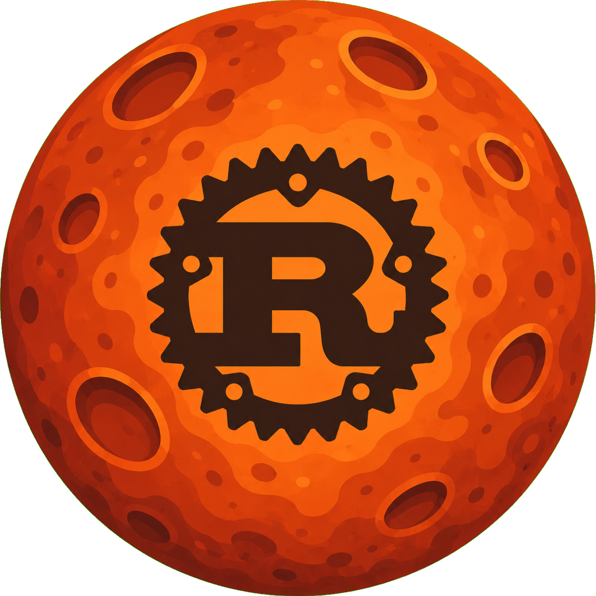

# Rust Defenders

<p align="left">
  

A small orbital arcade game built in Rust using raylib.

This was made mainly to learn Rust itself and not to be a polished game.  
Note: This is literally my first few lines of Rust code ever so the code quality might be sub optimal (at best).

</p>

<br clear="left"/>

<p align="center">
  
</p>

---

## What it is

You orbit around a central rust themed planet while:

* avoiding / colliding with incoming rocks
* shooting enemies
* gaining or losing score depending on what you hit

Simple, fast, and chaotic.

---

## Features

* Orbital player movement
* Enemy spawning from outside the screen
* Multiple enemy types (with different score effects)
* Shooting system (mouse click)
* Basic collision system (circle + rectangle)
* Score tracking

---

## Why this exists

This project was made to:

* learn Rust syntax and patterns
* short enough to be completed in a day
* complex enough to get a overview of rust
* figure out ownership / borrowing in a real program
* get comfortable with modules and project structure
* build something quickly instead of overthinking

---

## Tech

* Rust
* raylib (via raylib-rs)
* rand

---

## Running

Make sure you have Rust installed.

```bash
cargo run
```

---

## Controls

* **A / Left Arrow** → rotate left
* **D / Right Arrow** → rotate right
* **Left Mouse Click** → shoot

---

## Notes

* This is a learning project and NOT a finished game
* Code is intentionally simple and not heavily optimized
* Some parts may be messy — speed > perfection

---

## Future (maybe)

* Better textures / visuals
* Improved bullet logic
* Basic UI / menu
* Sound

(or not — depends on mood)

---

## Takeaway

The goal was to learn by building, not to build something perfect.

And it worked.
